InfoGAN
-------

This repository contains a straightforward implementation of [Generative Adversarial Networks](https://arxiv.org/abs/1406.2661) trained to fool a discriminator that sees real MNIST images, along with [Mutual Information Generative Adversarial Networks (InfoGAN)](https://arxiv.org/abs/1606.03657).

## Usage

* Install tensorflow

Then run for GAN:

```
python3 infogan/__init__.py
```

And InfoGAN:

```
python3 infogan/__init__.py --infogan
```

## Visualization

To see samples from the model during training you can use Tensorboard as follows:

```
tensorboard --logdir MNIST_v1_log/
```

## Expected Result

### GAN

You should now see images like these show up:


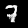


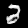
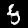
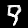


### InfoGAN

With category 0 active (squiggly snake pretzel):

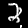


With category 1 active (V or 4):


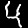


With category 2 active (3 or 1):

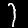

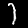

With category 3 active (unknown or 7s):

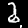
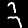


With category 4 active (Candy cane):


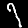

With category 5 active (Cantilevered snake):

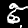
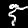
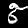

With category 6 active (7 with bubbles):

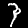
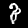
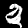

With category 7 active (hopping H):

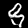
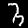
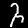

With category 8 active (lasso 7):

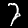

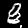

With category 9 active (C / Tetris piece):

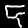


