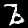
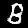
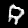
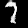

InfoGAN
-------

This repository contains a straightforward implementation of [Generative Adverserial Networks](https://arxiv.org/abs/1406.2661) trained to fool a discriminator that sees real MNIST images.

## Usage

* Install tensorflow

Then run:

```
python3 infogan/__init__.py
```

## Visualization

To see samples from the model during training you can use Tensorboard as follows:

```
tensorboard --logdir MNIST_v1_log/
```

## Expected Result

You should now see images like these show up:









