InfoGAN
-------

This repository contains a straightforward implementation of [Generative Adversarial Networks](https://arxiv.org/abs/1406.2661) trained to fool a discriminator that sees real MNIST images, along with [Mutual Information Generative Adversarial Networks (InfoGAN)](https://arxiv.org/abs/1606.03657).

## Usage

* Install tensorflow

Then run for GAN:

```
python3 infogan/__init__.py
```

And InfoGAN:

```
python3 infogan/__init__.py --infogan
```

## Visualization

To see samples from the model during training you can use Tensorboard as follows:

```
tensorboard --logdir MNIST_v1_log/
```

## Expected Result

### GAN

You should now see images like these show up:

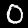
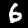
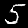
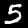
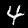
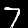
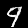
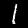

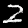
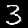

### InfoGAN

On tensorboard you should see the following properties emerge:

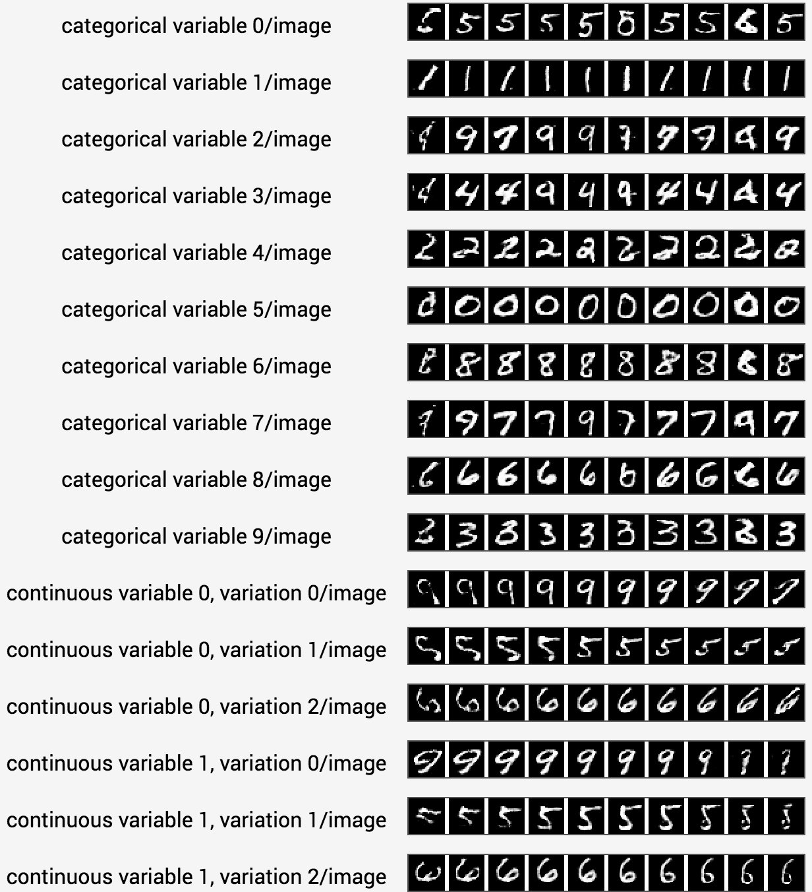

### InfoGAN for [chairs dataset](https://www.di.ens.fr/willow/research/seeing3Dchairs/)

Command line presented below will train Infogan for [chairs dataset](https://www.di.ens.fr/willow/research/seeing3Dchairs/) with the configuration that is supposed to uncover rotation as the continuous latent code. Download an untar dataset from [here](https://www.di.ens.fr/willow/research/seeing3Dchairs/data/rendered_chairs.tar), and make sure that is is located at `path/to/rendered_chairs/`

```bash
python3 train.py --dataset path/to/rendered_chairs/ --scale_dataset 64 64 --batch_size 128 --discriminator conv:4:2:64:lrelu,conv:4:2:128:lrelu,conv:4:2:256:lrelu,conv:4:1:256:lrelu,conv:4:1:256:lrelu,fc:1024:lrelu --generator fc:1024,fc:8x8x256,reshape:8:8:256,deconv:4:1:256,deconv:4:2:256,deconv:4:2:128,deconv:4:2:64,deconv:4:1:1:sigmoid --categorical_lambda 1.0 --continuous_lambda 10.0 --categorical_cardinality 20 20 20 --num_continuous 1 --style_size 128 --plot_every 400 --force_grayscale
```

*Note: generator architecture changed w.r.t. the publication, due to the fact that it was producing 32x32 images rather than 64x64 images as desired. Results may be different.*
